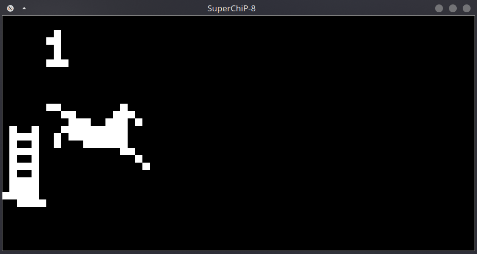
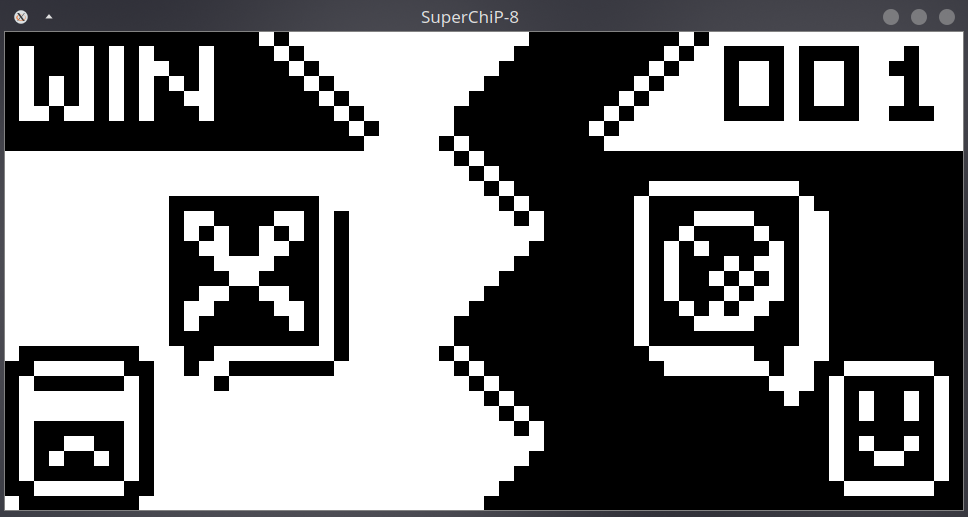
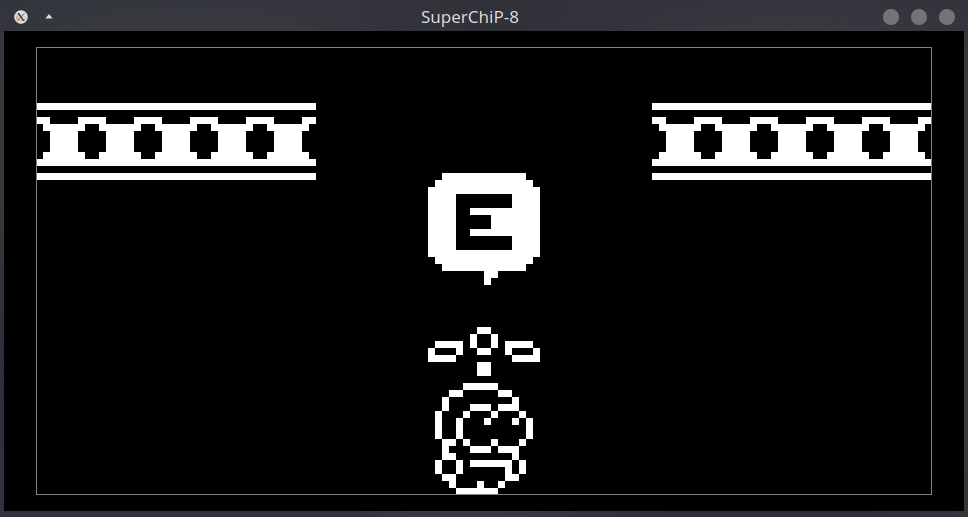
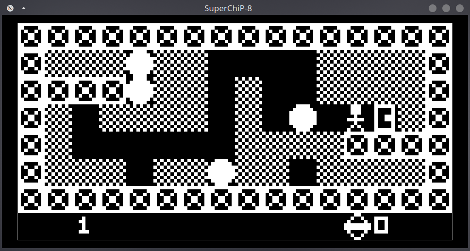

# SUPERCHIP-8

This repository is a cpp implementation of a SuperChip-8 emulator.

## Features

- Runs SuperChip-8 games
  - 64x32 resolution (LowRes)
  - 128x64 resolution (HiRes)
- Runs Chip-8 games
- Resizable screen

## Requirements

- raylib

## Compilation

```bash
git clone https://github.com/reddcarp/SuperChip8.git
cd SuperChip8
mkdir build && cd build
cmake ..
make
```

> **Note**:
> By default, the project is compiled in development mode (with debug symbols).
> To compile in release mode, follow the [Installation](#installation) instructions.

## Usage

Basic usage:

```bash
./SuperChip8 -r <path_to_rom>
```

options:

- `-r <path_to_rom>`: Path to the ROM file
- `-c <cpu_cycles>` : Number of CPU cycles per frame (default: 10)

## Screenshots

- LowRes games:

[horseyJump.ch8](https://johnearnest.github.io/chip8Archive/play.html?p=horseyJump)  |  [RPS.ch8](https://johnearnest.github.io/chip8Archive/play.html?p=RPS)
:-------------------------:|:-------------------------:
 |  

- HiRes games:

[sweetcopter.ch8](https://johnearnest.github.io/chip8Archive/play.html?p=sweetcopter)  |  [rockto.ch8](https://johnearnest.github.io/chip8Archive/play.html?p=rockto)
:-------------------------:|:-------------------------:
 | 

## Installation

```bash
cmake -DDEV_MODE=OFF ..
make && make install
```

## Useful links

Wikipedia:

- <https://en.wikipedia.org/wiki/CHIP-8>

Technical:

- <http://devernay.free.fr/hacks/chip8/C8TECH10.HTM>
- <https://chip8.gulrak.net/>
- <http://johnearnest.github.io/Octo/docs/SuperChip.html>

Blog posts:

- <https://tobiasvl.github.io/blog/write-a-chip-8-emulator/>
- <https://web.archive.org/web/20110426134039if_/http://www.multigesture.net/articles/how-to-write-an-emulator-chip-8-interpreter/>

Incremental Testing:

- <https://github.com/Timendus/chip8-test-suite?tab=readme-ov-file>

Games:

- <https://johnearnest.github.io/chip8Archive/>
- <https://www.reddit.com/r/EmuDev/comments/eb2nac/the_chip8_archive_a_collection_of_modern_chip8/>
