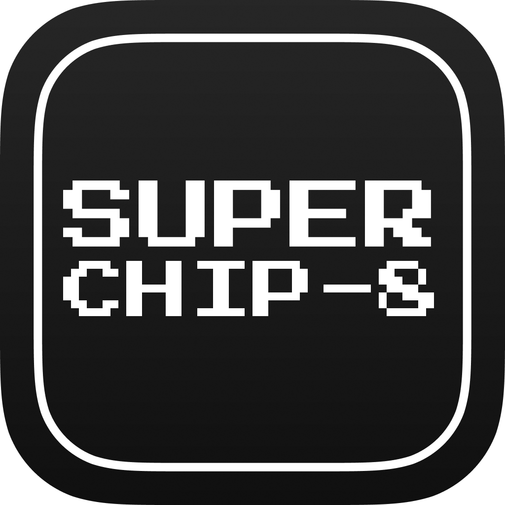
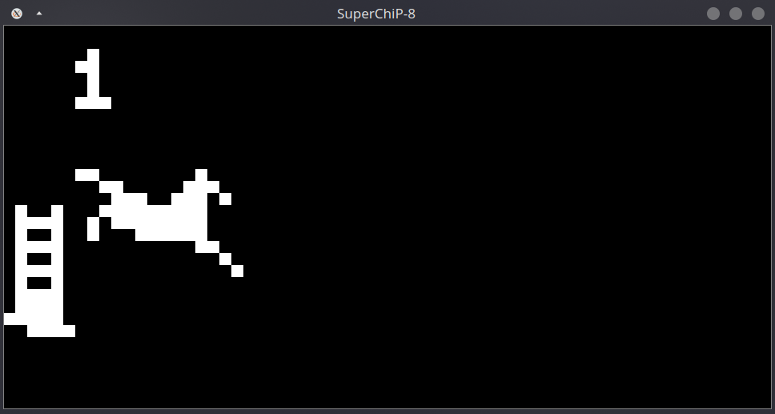
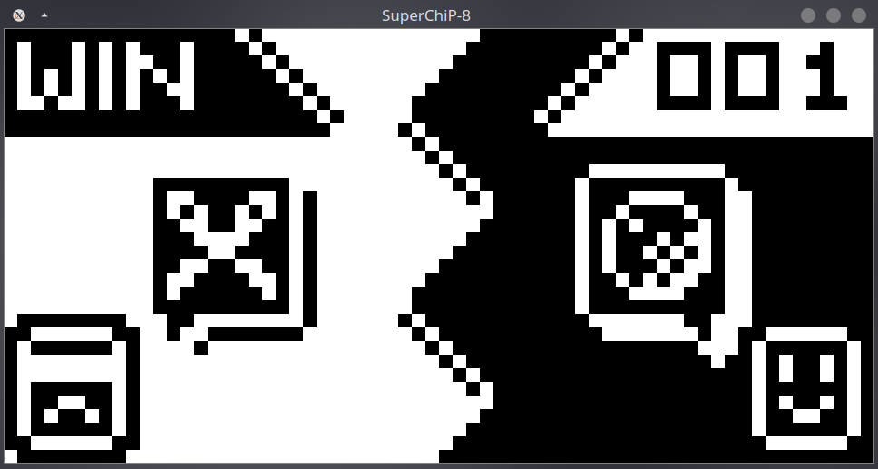
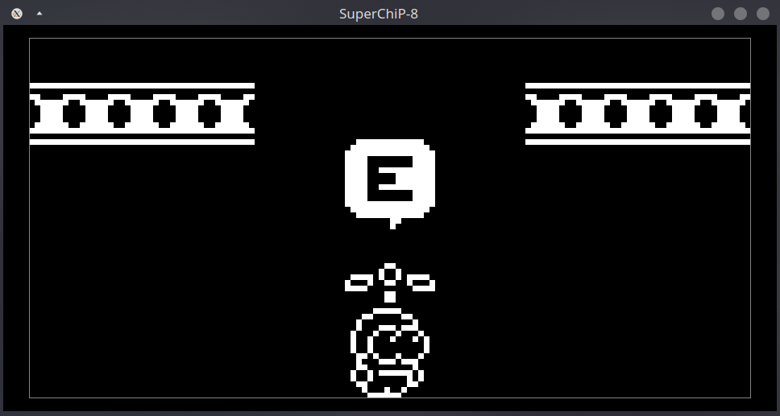
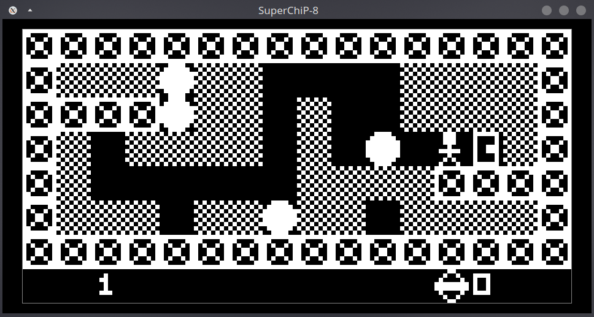

<p align="center">
  
</p>

<h1 align="center">SuperChip-8</h1>

<p align="center">
  <strong>A SuperChip-8 emulator written in cpp.</strong>
</p>

<p align="center">
  
  
  
</p>

## Screenshots

| [horseyJump.ch8](https://johnearnest.github.io/chip8Archive/play.html?p=horseyJump) | [RPS.ch8](https://johnearnest.github.io/chip8Archive/play.html?p=RPS) |
| :---: | :---: |
|  |  |

| [sweetcopter.ch8](https://johnearnest.github.io/chip8Archive/play.html?p=sweetcopter) | [rockto.ch8](https://johnearnest.github.io/chip8Archive/play.html?p=rockto) |
| :---: | :---: |
|  |  |

## Features

- [x] SuperChip-8 game compatible
- [x] Chip-8 game compatible
- [x] LowRes game compatible (64x32)
- [x] HiRes game compatible (128x64)
- [x] Resizable window

## Usage

Requirements:

- raylib

1. **Clone the repository**

    ```bash
    git clone https://github.com/reddcarp/SuperChip8.git
    ```

2. **Build binary**

    ```bash
    cd SuperChip8
    mkdir build && cd build
    cmake ..
    make
    ```

3. **Run binary**

    ```bash
    ./SuperChip8 -r <path_to_rom>
    ```

options:

- `-r <path_to_rom>`: Path to the ROM file
- `-c <cpu_cycles>` : Number of CPU cycles per frame (default: 10)

> **Note**:
> By default, the project is compiled in development mode (with debug symbols).
> To compile in release mode, follow the [Installation](#installation) instructions.

## Installation

```bash
cmake -DDEV_MODE=OFF ..
make && make install
```

## Useful links

Wikipedia:

- <https://en.wikipedia.org/wiki/CHIP-8>

Technical:

- <http://devernay.free.fr/hacks/chip8/C8TECH10.HTM>
- <https://chip8.gulrak.net/>
- <http://johnearnest.github.io/Octo/docs/SuperChip.html>

Blog posts:

- <https://tobiasvl.github.io/blog/write-a-chip-8-emulator/>
- <https://web.archive.org/web/20110426134039if_/http://www.multigesture.net/articles/how-to-write-an-emulator-chip-8-interpreter/>

Incremental Testing:

- <https://github.com/Timendus/chip8-test-suite?tab=readme-ov-file>

Games:

- <https://johnearnest.github.io/chip8Archive/>
- <https://www.reddit.com/r/EmuDev/comments/eb2nac/the_chip8_archive_a_collection_of_modern_chip8/>
